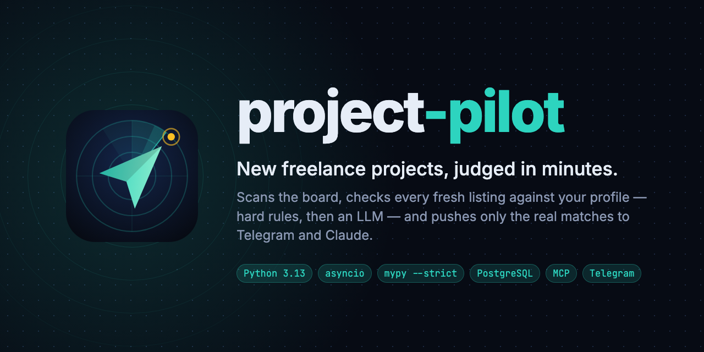
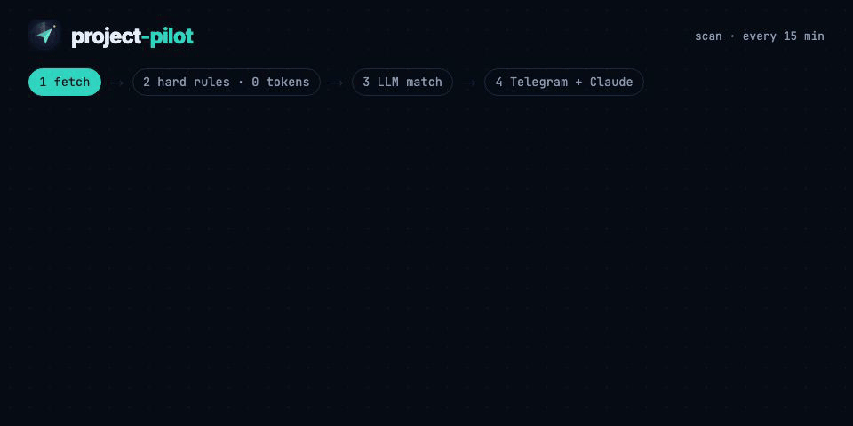
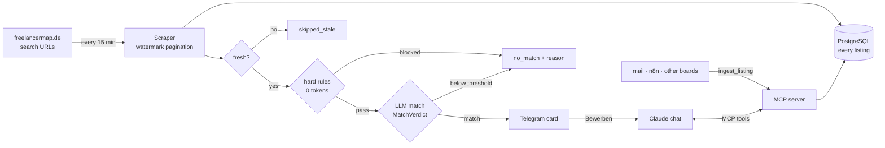
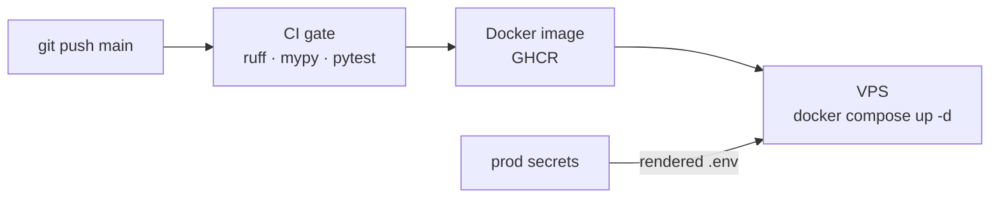

<p align="center">
  
</p>

<p align="center">
  <a href="https://github.com/nikita-petrich/project-pilot/actions/workflows/ci.yml"></a>
  
  
  
  
  
  
</p>

<p align="center">
  <a href="#how-it-works">How it works</a> ·
  <a href="#quick-start">Quick start</a> ·
  <a href="#commands">Commands</a> ·
  <a href="#notification-and-claude-setup">Claude & Telegram</a> ·
  <a href="#applying-from-a-match-session">Applying</a> ·
  <a href="#deploying">Deploying</a> ·
  <a href="#development">Development</a>
</p>

---

A personal, single-user worker that watches freelancermap.de for new project
listings, persists every listing losslessly in PostgreSQL, evaluates fresh ones
against a profile (deterministic hard rules, then an LLM match), and pushes real
matches within minutes: each match opens its own Claude chat in your account,
and a Telegram card with three buttons delivers it to phone and laptop. Backend
only, no web UI — the Claude app is the entire interaction surface.

|  |  |
|---|---|
| **Nothing is missed** | A watermark closes every gap after downtime; every listing ever seen lands in the database. |
| **Judged, not keyword-matched** | Hard rules first (0 tokens), then a structured LLM verdict with a stored reason for match *and* no-match. |
| **Minutes, not a daily digest** | Scans every 15 minutes and sends a Telegram card seconds after the verdict. |
| **Worked in Claude** | One tap opens a Claude chat with the card; checks, drafts and the send run through project-pilot's own MCP tools. |

Built as a modern, strictly-typed Python codebase (Python 3.13, asyncio,
Pydantic v2, SQLAlchemy 2.0, `mypy --strict`). The binding detail specification is
[`SPEC.md`](SPEC.md); the design is summarized in
[`blueprint/context/project-overview.md`](blueprint/context/project-overview.md).

## How it works

<p align="center">
  
</p>



Every `SCAN_INTERVAL_MIN` minutes (default 15) the worker:

1. Fetches the configured search URLs politely (identifying user agent, robots.txt
   gate, delays), paginating with a watermark so nothing is missed after downtime.
2. Persists every newly seen listing (lossless). On an empty database the first
   run seeds the full inventory without analysing or notifying.
3. For each new, fresh listing (within the analysis window), runs the evaluation
   pipeline: freshness gate, then hard rules from `profile/private.yaml` (0 tokens),
   then an LLM match against the profile read from sequenz.io, producing a
   structured verdict.
4. For every match at or above `MATCH_THRESHOLD`, sends a Telegram card whose
   **Bewerben** button opens a new Claude chat with that very card already in
   its prompt (a `claude.ai/new?q=…` link — the chat is created the moment you
   send, not before). A reason is stored for every verdict — match
   and no-match alike — for later reporting.

The card is rendered in code (`notification/messages.py`), not left to the model,
so every alert is scannable the same way:

```
🎯 Senior Backend Entwickler (Node.js)  ·  87/100
🏢 One Day Ahead GmbH  ·  Agency
📍 Frankfurt am Main, Deutschland  ·  🏠 100%
📅 01.09.2026  ·  ⏳ 4 mo (+ extension)  ·  📊 100%  ·  🕒 5 min ago
✅ Fits: Node.js-/Express.js-Stack deckt den Backend-Fokus, REST, Docker und PostgreSQL sind im Profil abgedeckt
⚠️ Risks: Agentur-Listing, Endkunde nicht genannt
🔗 https://www.freelancermap.de/projekt/…
```

Company and location always get their line: a listing that names neither is
itself a signal, so the card says so rather than dropping it silently.

Everything after the tap happens in that session: ask questions, have the
application drafted and revised, and send it, through the MCP server this project
also ships. **Ablehnen** on the card deletes it, **Projektbeschreibung öffnen**
opens the original ad. Operator warnings (source cooldown, LLM health, repeated
failures) arrive as plain Telegram messages.

## Quick start

**Requirements**

- Python 3.13 and [uv](https://docs.astral.sh/uv/)
- PostgreSQL 16 (locally via `compose.dev.yaml`, or your own instance)
- An API key for the LLM (OpenAI or Anthropic), a Telegram bot, and a Claude plan
  with the MCP connector and the account skills for the chat per match
  ([`docs/claude-setup.md`](docs/claude-setup.md))
- Docker with Compose for the containerized home-server deployment

**Setup**

```sh
uv sync                                    # install dependencies (creates .venv)
cp .env.example .env                       # then fill in the values (see below)
docker compose -f compose.dev.yaml up -d   # local Postgres on :5432
uv run project-pilot init-db               # apply migrations
```

Forking this for yourself? Point `PROFILE_URL` at your own site and replace the
CVs in the Drive folder (`CV_DRIVE_FOLDER_ID`) with your own.

### Profile

**The profile is not in this repository.** It is the website's, fetched at boot,
because a profile maintained in two places is a profile that is wrong in one of
them — and the wrong one is always the copy nobody looks at. What cannot be
published stays here.

<details>
<summary><b>The website</b> — <code>PROFILE_URL</code>, read fresh at every start</summary>

<br>

Two documents are read from `PROFILE_URL`:

- `/<locale>.md` — the markdown twin of the profile page: positioning, skills,
  reference projects, testimonials. Generated on the site from the same content
  the page renders, so it cannot drift from what a human sees.
- `/api/profile.json` — the figures prose carries imprecisely: availability,
  capacity, the on-site ceiling, the rate, the booking links per language, the
  platform profiles.

project-pilot renders the second into an `Availability & terms` and a
`Contact & Signature` block, because the application prompt looks values up by
name (`Phone`, `Email`, `Web`, `LinkedIn`, `GitHub`, `CTA German` / `CTA English`,
`Location German` / `Location English`, `VAT ID`) and a paragraph is the wrong
place to look for a VAT id. The two ready-made sentences in the feed — availability
and rate, per language — are quoted verbatim into the application.

A failed fetch aborts and warns over Telegram. There is **no** fallback to an older
copy: every verdict stores the `profile_hash` it was judged against, and a silent
fallback would file today's verdict under yesterday's profile. Each new profile
state is kept once in `profile_snapshots`, so that hash always names a text that
still exists.

</details>

<details>
<summary><b><code>profile/private.yaml</code></b> — the half that cannot be published</summary>

<br>

The no-go industries (defence, adult) and the context-dependent no-go
technologies. These are statements about clients rather than about skills, and a
company homepage is the wrong place for them — so they stay in the repo and are
appended to the fetched profile before the LLM sees it.

The same file carries the deterministic rules: `blacklist` terms and an optional
`must_have`, both matched against the listing text before the LLM (0 tokens), plus
`nogo_technologies`.

The last one is the profile's context-dependent no-gos (Java, PHP, WordPress,
Django, SAP): they are deliberately **not** matched against the listing text — a
frontend role against a Java backend or a migration away from PHP stays welcome —
but against the LLM's own answer. When the model reports one of them under
`missing_requirements`, i.e. the listing requires the candidate to bring it and the
profile does not cover it, the verdict is forced to `no_match` whatever the score,
and the stored reason names the term (`nogo`). The term lists stay exact lists:
matching is case-insensitive with word boundaries, so `java` never fires on
"JavaScript" while `spring` still catches "Spring Boot".

</details>

<details>
<summary><b>CVs</b> — pulled from Google Drive, attached to every send</summary>

<br>

**Both CVs ride along on every send**, so the recipient can forward whichever
language they need; the draft language only decides which one leads. They live in
a public Google Drive folder (`CV_DRIVE_FOLDER_ID`) and are fetched by file name
into a local cache before each draft and each send (`application/cv_drive.py`),
so updating a CV is replacing the file in Drive — no commit, no redeploy.

`CV_DE_PATH` and `CV_EN_PATH` default to `cv/CV-German.pdf` and
`cv/CV-English.pdf`; their basenames are both the Drive lookup keys and what the
recipient sees. If Drive is unreachable the last cached copy is used; a CV that can
be fetched from neither is skipped and named in the draft's `📎 Attachments` line.
Set `CV_DRIVE_FOLDER_ID` empty to use plain local files instead. Keep them a few MB
at most — base64 adds about a third on the wire.

</details>

### Environment

Set the environment values in `.env` (never commit real secrets; `.env` is
gitignored and `.env.example` is the template):

<details>
<summary><b>All variables</b></summary>

<br>

| Variable | Purpose |
|---|---|
| `DATABASE_URL` | `postgresql+asyncpg://...` |
| `CONTACT_MAIL` | inserted into the scraper user agent |
| `TELEGRAM_BOT_TOKEN` / `TELEGRAM_CHAT_ID` | the bot from @BotFather and your private chat with it — the alert channel |
| `CLAUDE_SESSION_URL` | the page the Bewerben button opens with the card in `q` (default `https://claude.ai/new`; `https://claude.ai/code/new` for a Code session) |
| `MCP_TOKEN` / `MCP_PORT` | bearer token for the MCP server (`openssl rand -hex 32`) and its port (default 8765) |
| `PROXY_NETWORK` | VPS only: the Docker network the reverse proxy runs on, so it can reach `project-pilot-mcp` |
| `LLM_PROVIDER` | `openai` (default) or `anthropic` — which API the matching and the drafts call |
| `OPENAI_API_KEY` / `ANTHROPIC_API_KEY` | only the selected provider's key is required |
| `LLM_MODEL` | model name for that provider, e.g. `gpt-5.6-luna` or `claude-opus-5` |
| `LLM_EFFORT` | optional, both providers: reasoning depth (`low`…`max`); empty means it is not sent at all |
| `SEARCH_URLS` | comma-separated board search URLs, sorted "newest first" |
| `SCAN_INTERVAL_MIN` | default 15, validated to be >= 15 |
| `ANALYSIS_WINDOW_MIN` | default 30 |
| `MATCH_THRESHOLD` | default 60 |
| `LOG_LEVEL` | default `info` |
| `SMTP_HOST` / `SMTP_PORT` / `SMTP_USER` / `SMTP_PASSWORD` | your mail server, used to send application e-mails (port 465 implies TLS, otherwise STARTTLS) |
| `SMTP_FROM` / `SMTP_STARTTLS` | optional sender override (defaults to `SMTP_USER`) and STARTTLS toggle |
| `CV_DRIVE_FOLDER_ID` / `CV_DE_PATH` / `CV_EN_PATH` | the public Drive folder the CVs come from and their file names (see CVs above) |

</details>

## Commands

```sh
uv run project-pilot init-db        # apply Alembic migrations
uv run project-pilot run-once       # one scan now (non-zero exit on a failed run)
uv run project-pilot daemon         # the scan loop until SIGTERM
uv run project-pilot telegram-bot   # hears the card's Ablehnen button (long polling)
uv run project-pilot mcp            # the MCP server (Streamable HTTP + bearer token)
uv run project-pilot test-match     # rules + LLM + a real push, stores nothing
uv run project-pilot test-filter    # dry-run the filter against a listing
uv run project-pilot stats          # reporting summary
uv run project-pilot healthcheck    # liveness/freshness probe (exit code)
uv run project-pilot enrich "<company>" [--person "First Last"] [--url https://…]
uv run project-pilot enrich --listing-id <id>   # enrich a stored listing, record the lead
```

## Notification and Claude setup


Three pieces, all in [`docs/claude-setup.md`](docs/claude-setup.md):

1. **The Claude chat**, one per match, opened by the card's **Bewerben**
   button: a `https://claude.ai/new?q=…` link that prefills a new chat with the
   same card the alert showed, its research links, and the order to draft the
   application at once. One tap on send and the chat exists — and only then,
   so a declined match never creates one. The chat has the account's
   project-pilot MCP connector and skills and is where the match is worked;
   no repository, so nothing but the card weighs on its context
   (`notification/claude_link.py`).
2. **The Telegram card**, sent by the worker itself seconds after the verdict:
   the card and three buttons. Two are plain links (the original listing, the
   session); only **Ablehnen** needs a process — `project-pilot telegram-bot`
   long-polls for that press and deletes the card. Delivery never depends on a
   model judging a run worth reporting: the official docs offer no guaranteed
   push for a cloud session, so the alert stays in code where it can be
   retried. The proxy's site config for the public MCP endpoint is in
   [`deploy/proxy-site/`](deploy/proxy-site). The bot's name, descriptions and
   profile photo are set by [`media/telegram-profile.sh`](media/README.md).
3. **The workflow prompts**, exposed by the MCP server itself
   (`mcp_prompts.py`), so one definition serves every surface: Claude Code
   lists them as `/mcp__project-pilot__check_project`, and n8n calls them the
   same way. The account skills in
   [`deploy/claudeai-skills/`](deploy/claudeai-skills) are thin wrappers over
   the same tools for surfaces that don't show MCP prompts.

### MCP tools

Ten tools are exposed, and any Claude chat that has the connector can use them:

| Tool | Does |
|---|---|
| `list_matches` / `get_listing` | the feed and one listing in full, with its evaluations |
| `ingest_listing` | store a listing that did not come from the scanner, with its provenance |
| `check_listing` / `check_text` | re-run the verdict on a stored listing or on pasted text |
| `draft_application` / `revise_application` | write and rework a draft |
| `set_recipient` / `send_application` | address it, and — only on your explicit go — send it |
| `enrich_company` | contact data from the company's own website |

n8n speaks the same protocol, so a workflow can ingest and check incoming
recruiter mails without duplicating any of the judgment.

### Listings from anywhere else

A recruiter mails, a client sends a PDF, someone screenshots a listing, an n8n
workflow forwards one from another board. `ingest_listing` stores it like any
other listing and records two things about where it came from:

| Column | Answers | Values |
|---|---|---|
| `listings.source` | **which platform** | `freelancermap`, `linkedin`, `malt`, an agency name, … — read off the URL, or passed in; `manual` for text with no URL |
| `listings.origin` | **which channel** | `scan`, `chat`, `mail`, `pdf`, `image`, `url`, `api` |

`raw["ingest"]` keeps the detail (a note, the supplied URL, the timestamp).
Everything downstream then works on it unchanged: check, draft, revise, send,
reporting.

Dedupe is the scanner's own: an absolute listing URL is canonicalized and hashed
exactly as the scraper does it, so a link you check by hand and the page the
scanner later fetches are **one** row, not two. Text with no URL is keyed by the
text, so the same mail pasted twice is the same listing. A bare path is never
resolved against the scraped board — it could belong to any host, so it is keyed
by its text instead of being guessed at.

### Which parts are tied to freelancermap

Only the scraper. Everything else was built source-agnostic and stays that way:

| Layer | Bound to a board? |
|---|---|
| `ingestion/parser.py`, `SEARCH_URLS`, `source_state` watermark | **yes** — freelancermap's HTML and pagination |
| data model (`listings.source` per row, `source_state` keyed by source) | no |
| evaluation (`private.yaml`, `match.v7.md`, the no-go gate) | no — neither prompt names a board |
| application drafting, enrichment, sending | no |
| MCP tools, the Claude chat, the Telegram card, the skills | no |

So a second board reaches the database today through `ingest_listing` (an n8n
workflow forwarding its mails costs no code at all), and *scanning* one is a new
parser plus its search URLs — build-plan item 15, deliberately not built yet.

## Applying from a match session

Ask for it in the session — "schreib die Bewerbung" — and the LLM writes a
personalized application. The single prompt file
`src/project_pilot/application/prompts/application.md` holds the full application
prompt (style rules, reference projects, skills, signature); edit it directly to
change how applications are written.

| Step | What happens |
|---|---|
| **Full draft** | Subject, the complete e-mail, and a LinkedIn connection message, returned in one piece and never truncated. |
| **Recipient** | Auto-extracted from the listing when an e-mail address is visible anywhere in it; otherwise name it in the chat, or ask for the contact to be looked up (see below). |
| **Revise** | Say what you want changed ("kürzer", "auf Englisch", "betone RAG-Erfahrung") and the draft is rewritten in place. Paste or attach a screenshot and it goes to the model as vision input, so a picture of the client's reply or of a listing detail can drive the revision. |
| **Send** | Only after you have read the draft and said so. `send_application` delivers it through your SMTP server with the CVs attached; a status guard makes a second send impossible, and a failure keeps the draft intact. |
| **CV attachments** | Every sent e-mail carries both configured CV PDFs (DE and EN); the draft language only decides which one leads. The draft names them in a `📎 Attachments` line beforehand, including any CV that could not be fetched, so a gap is visible before the send rather than after. |
| **Signature** | Every draft closes with a signature block in the draft's language: the `-- ` separator (RFC 3676), the greeting inside the block, name and title, `Tel./Phone`, `E-Mail`, `Web`, `LinkedIn`, `GitHub`, the 30-minute booking link, then location and VAT ID — values from the website's profile feed, layout from the prompt. The confidentiality notice follows as the last block. |

> [!IMPORTANT]
> Nothing else in the system can reach outward, which is the point: the model reads
> untrusted listing text, so it never holds the outbound channel on its own.

The same flow works from any Claude chat with the connector, not just from a match
session: paste a listing, run `check_text`, then draft from it.

## Finding a contact (enrichment)

Enrichment is always on — the apply flow needs a recipient (the text continues
on). When a match names a company but no reachable e-mail, ask for the contact in
the session (`enrich_company`) and project-pilot looks the company's contact
channel up:

1. **Company website** — a web search (`ENRICHMENT_SEARCH=duckduckgo`, or pass a known
   `--url`) finds the official site, then its **Impressum / Kontakt / Team / Karriere**
   pages are read for e-mails, phone numbers, and contact-person names. In Germany the
   Impressum is legally-required public contact data, so this is the reliable source of
   a phone/e-mail. Fetches are polite and robots-aware; a 403 is never retried.
2. **LinkedIn & Google** — surfaced as **one-click research links** (company search,
   people search, Google contact search). These open in your own browser; **nothing on
   LinkedIn or Google is ever scraped** — that would breach their terms, and LinkedIn
   never exposes phone/e-mail publicly anyway.
3. **LinkedIn connection message** — every result includes a short, personalized German
   **Vernetzungsnachricht** (≤300 chars, ready to copy) so you can send the connection
   request to the Ansprechpartner yourself. It signs with your name from
   the profile's Contact & Signature block; `OUTREACH_OFFER_DU=true` (the default) offers
   first-name terms ("Gerne auch per Du.").

The result comes back in the session (e-mails best-first, phone, named people, the
connection message, the research links) and is stored in `contact_leads`. Name a
found address in the chat to set it as the draft's recipient. From the shell:

```sh
uv run project-pilot enrich "Muster GmbH" --person "Max Mustermann"
uv run project-pilot enrich --listing-id 42     # uses the listing's company + records a lead
```

<details>
<summary><b>JS-rendered sites (optional)</b></summary>

<br>

Some sites inject their contact data via JavaScript, which the default httpx fetcher
can't see. Set `ENRICHMENT_RENDER=true` to fetch company pages with a headless
Chromium instead — install the extra once:

```sh
uv sync --extra render && uv run playwright install chromium
```

Rendering keeps the same manners (identifying user agent, robots gate, delay, no 403
retry); only company pages are rendered, never LinkedIn or Google.

</details>

## Checking a listing on demand

`check_listing` (a stored listing) and `check_text` (a pasted description or
recruiter mail) run anything through the same evaluation the scanner uses — hard
rules from `profile/private.yaml` first (0 tokens), then the LLM match against your
profile. Both return the verdict in full:

- **Match (score ≥ `MATCH_THRESHOLD`)** — facts, reasons, matching skills, gaps and
  risks, so the apply flow can start from it exactly as if the scanner had found it.
- **No match** — the failed hard rule (the matched blacklist term) or the LLM's
  score, reasons, and gaps, so you see *why* it doesn't fit. A listing that requires
  one of the `nogo_technologies` lands here too, with the term named first.

A check is read-only: nothing is stored, the freshness gate is skipped, and the
scanner's watermark stays untouched.

Two ways reach the same judgment without the server:
[`/check-project`](.claude/skills/check-project/SKILL.md) and
[`/write-application`](.claude/skills/write-application/SKILL.md) are skills any
Claude session with this repository can run. They are thin wrappers that read the
canonical prompt and profile files at runtime rather than restating their rules, so
a skill and the pipeline cannot drift apart — change a judgment rule in
`evaluation/prompts/match.v7.md`, never in the skill.

## Deploying

Pushing to `main` deploys to the VPS: GitHub Actions runs the quality gate, builds
the image into GHCR, and the server pulls it over SSH. The server holds no
configuration of its own — the app's `.env` is rendered from the secrets of the
`prod` environment and written on every deploy. Setup, secrets, and rollback are in
[`docs/deployment.md`](docs/deployment.md).



> [!NOTE]
> The deploy refuses to start if `TELEGRAM_BOT_TOKEN`, `TELEGRAM_CHAT_ID` or
> `MCP_TOKEN` is missing, and fails before touching the server: a worker that finds
> matches it cannot deliver is worse than one that does not run.

To build and run on the host instead, from a checkout:

```sh
docker compose build
docker compose up -d
docker compose logs -f app
```

Either way the app container applies migrations on start, then runs the daemon (with
one immediate scan). Full operations guide, including the healthcheck and
troubleshooting, is in [`docs/operations.md`](docs/operations.md).

## Threshold tuning

After a few days, run `stats` and inspect the verdict distribution and stored
scores. Raise `MATCH_THRESHOLD` if you get too many weak alerts; lower it if real
matches are missed. Restart the worker after changing `.env`.

## Troubleshooting

| Symptom | What to do |
|---|---|
| **Cooldown** | A 403 or captcha sets a 6-hour cooldown in `source_state`; the worker skips scans until it expires and sends one warning. |
| **`SelectorMismatchError`** | freelancermap changed its markup. Update the selector constants at the top of `src/project_pilot/ingestion/parser.py`, refresh the fixtures, and re-run. |
| **Repeated failures** | Three consecutive failed runs send one warning. |
| **Container unhealthy** | No successful run within three times the interval; check `docker compose logs app`. |
| **Healthy, but no matches arrive** | The LLM is the one dependency whose failure still produces successful runs (every listing falls back to `llm_error`). The daemon preflights `LLM_MODEL` on start and sends a warning naming the cause — wrong model, rejected key, or an account out of credit — then announces recovery once it works again. See `docs/operations.md`. |
| **No card for a match** | Delivery failed. `docker compose logs app` shows `telegram send failed`; the listing keeps `notified_at` empty and the next scan retries it — with the same session, whose URL was already stored. |
| **Bewerben opens a session that shows no card** | The listing was so large that the card left the link (`MAX_URL_CHARS` in `claude_link.py`); the prompt then asks the session to render it from the database instead. Everything else works the same. |

## Development

```sh
uv run ruff check           # lint
uv run ruff format --check  # format
uv run mypy                 # strict type check
uv run pytest               # tests (Postgres-backed tests skip if no DB)
uv run pytest -m eval       # judgment eval against the golden set (real LLM calls)
```

Tests never make live network requests; freelancermap pages and external APIs are
served from fixtures or mocked. Test files live next to the code under `tests/`.

The logo, banner, animation and Telegram avatar are
[Remotion](https://www.remotion.dev) compositions in [`media/`](media/README.md):
`cd media && npm install && npm run render` rebuilds everything in `docs/assets/`.

## Compliance and legal

project-pilot is for **personal use only**. It reads only pages that are publicly
reachable without login, with a clear, identifying user agent
(`project-pilot/1.0 (personal project alert bot; contact: <CONTACT_MAIL>)`), a
startup `robots.txt` gate (including `Crawl-delay`), a 2 to 5 second delay between
requests, and at most two list pages per search URL (detail pages only for new
listings). There is no login bypass, no captcha or bot-protection circumvention,
and no user-agent or proxy rotation. A 403 or captcha triggers a 6-hour cooldown
rather than retry hammering.

Before the first live run, confirm freelancermap's current `robots.txt` and Terms
of Service permit this use. The full compliance record, the STOP conditions, and
the first-run verification checklist are in
[`docs/compliance.md`](docs/compliance.md) and
[`docs/adr/0001-source-verification.md`](docs/adr/0001-source-verification.md). Do
not resell or redistribute scraped data.

The same posture governs **contact enrichment**: it reads only a company's own public
website (the legally-required Impressum and its contact pages), with the identifying
user agent, a per-host `robots.txt` gate, a spacing delay, and no 403 retry. It **does
not scrape LinkedIn or Google** — those are only ever offered as search links you open
yourself. Enrichment reads only company websites, and it processes
personal contact data (names, e-mails, phone numbers) solely so you can apply to the
project — use it accordingly and do not store or share the results beyond that purpose.

## Project layout

```
src/project_pilot/
  config.py profile_loader.py errors.py db.py models.py repository.py
  ingestion/    client, parser, normalize, watermark
  evaluation/   freshness, rules, llm, schemas, check, prompts/
  enrichment/   fetch, render, search, extract, links, message, service, listing
  notification/ claude_link (the session link), telegram (the card), messages
  telegram_bot  hears the Ablehnen button
  mcp_prompts   the workflow prompts, one source for every surface
  application/  generator, service, mailer, documents, cv_drive (apply flow)
  mcp_server.py the tools any Claude surface calls
  pipeline.py scheduler.py reporting.py cli.py
alembic/        async migrations
deploy/         render-env.py, remote-deploy.sh, proxy/ (Caddy for the MCP host)
docs/           claude-setup.md, deployment.md, operations.md, compliance.md, adr/, assets/
media/          Remotion project: logo, banner, README animation, Telegram avatar
tests/          unit + integration, fixtures/, eval/ (golden set)
```

---

<p align="center">
  <br>
  <sub>Built with the <a href="blueprint/README.md">AI Coding Blueprint</a> · agent instructions in <a href="AGENTS.md">AGENTS.md</a> and <a href="CLAUDE.md">CLAUDE.md</a></sub>
</p>
